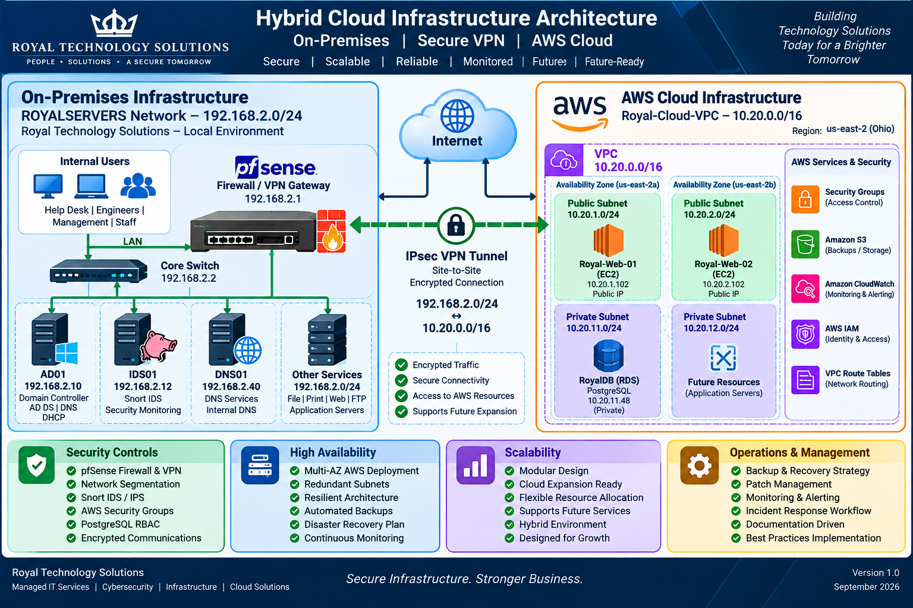

# Royal Technology Solutions

## Hybrid Cloud Infrastructure Project


---

## Project Overview

This project documents the design, implementation, migration, security, monitoring, and operational management of a hybrid enterprise infrastructure connecting an on-premises environment with Amazon Web Services (AWS).

The architecture was developed as a hands-on enterprise infrastructure project for Royal Technology Solutions. It combines network infrastructure, perimeter security, encrypted hybrid connectivity, cloud services, database systems, intrusion detection, backup and recovery, and operational security processes.

The project demonstrates how infrastructure components can be designed and integrated into a cohesive enterprise environment rather than operating as isolated technologies.

---

## Project Objectives

The primary objectives of the project are to:

- Design an enterprise-style hybrid infrastructure

- Connect on-premises infrastructure with AWS

- Implement secure network segmentation

- Deploy pfSense as a firewall and VPN gateway

- Implement intrusion detection with Snort

- Deploy AWS VPC infrastructure

- Migrate RoyalDB PostgreSQL into Amazon RDS

- Implement database security and role-based access

- Establish backup and disaster recovery procedures

- Document patch management

- Establish monitoring and alerting operations

- Develop an incident response workflow

- Validate infrastructure functionality and security controls

---

## Project Highlights

This project represents a hands-on hybrid enterprise infrastructure environment designed and implemented for Royal Technology Solutions.

Key implementation areas include:

- Enterprise network segmentation, routing, VLANs, ACLs, OSPF, and HSRP
- pfSense perimeter firewall and IPsec site-to-site VPN connectivity
- AWS VPC architecture across multiple Availability Zones
- EC2 web infrastructure and private Amazon RDS PostgreSQL
- RoyalDB relational database architecture and AWS migration
- PostgreSQL role-based access control and least-privilege security
- Snort-based intrusion detection and security monitoring
- Backup, disaster recovery, patch management, and incident response
- Infrastructure validation across networking, cloud, database, and security layers

---


## Architecture Overview

The completed architecture is organized into five primary infrastructure layers:

- Network infrastructure
- Security
- Cloud infrastructure
- Data services
- Operations and management

The overall environment is represented in the architecture diagram below.



## On-Premises Infrastructure

The on-premises environment provides the foundation for the hybrid architecture.

Primary infrastructure includes:

- pfSense firewall
- ROYALTYLAN network
- ROYALSERVERS network
- DNS infrastructure
- Windows Server infrastructure
- Linux infrastructure
- IDS/Snort security monitoring
- Internal services
- Administrative systems

Current server network: ROYALSERVERS

IP Address: 192.168.2.0/24

Gateway: 192.168.2.1

Key infrastructure systems include:

| System | Address | Function |
|---|---|---|
| pfSense | 192.168.2.1 | Firewall / VPN Gateway |
| IDS01 | 192.168.2.12 | Snort IDS |
| DNS01 | 192.168.2.40 | DNS Services |

## Hybrid Connectivity

The on-premises environment connects to AWS using an IPsec site-to-site VPN.

```text
On-Premises
192.168.2.0/24
      |
      v
pfSense Firewall
192.168.2.1
      |
      v
IPsec Site-to-Site VPN
      |
      v
AWS Virtual Private Gateway
      |
      v
Royal-Cloud-VPC
10.20.0.0/16
```
The VPN provides encrypted private communication between the on-premises infrastructure and the AWS VPC.

## AWS Cloud Infrastructure

The AWS environment is deployed in the `us-east-2` (Ohio) region using the `Royal-Cloud-VPC` with CIDR `10.20.0.0/16`.

The architecture uses two Availability Zones:

- `us-east-2a`
- `us-east-2b`

### Public Subnets

| Subnet | CIDR | Availability Zone |
|---|---|---|
| Royal-Public-Subnet-1 | 10.20.1.0/24 | us-east-2a |
| Royal-Public-Subnet-2 | 10.20.2.0/24 | us-east-2b |

### Private Subnets

| Subnet | CIDR | Availability Zone |
|---|---|---|
| Royal-Private-Subnet-1 | 10.20.11.0/24 | us-east-2a |
| Royal-Private-Subnet-2 | 10.20.12.0/24 | us-east-2b |

### AWS Services

- Amazon VPC
- Amazon EC2
- Amazon RDS PostgreSQL
- Security Groups
- IAM
- Virtual Private Gateway
- Internet Gateway
- Route Tables


## RoyalDB

RoyalDB is the PostgreSQL relational database supporting the Royal Technology Solutions service-ticketing architecture.

The database contains entities supporting:

- Customers
- Locations
- Devices
- Contracts
- Tickets
- Technicians
- Ticket assignments

### Database Security

Database security includes:

- Primary keys
- Foreign keys
- Unique constraints
- Role-based access control
- Least-privilege permissions
- Database backup and recovery procedures

### Configured Database Roles

- `royaldb_dba`
- `royaldb_tech`
- `royaldb_readonly`

## RoyalDB Cloud Migration

The on-premises PostgreSQL RoyalDB environment was migrated into Amazon RDS PostgreSQL.

The migration process included:

- Database schema extraction
- Database backup
- Schema restoration
- Table validation
- Data validation
- Relationship validation
- Constraint verification
- Role and permission planning
- AWS private database deployment

The AWS database is deployed privately within the `Royal-Cloud-VPC` architecture.


## Security Architecture

Security is implemented through multiple layers across the on-premises and AWS environments.

```text
Internet
   |
   v
pfSense Firewall
   |
   v
Network Segmentation
   |
   v
IPsec VPN
   |
   v
AWS Security Groups
   |
   v
Private Resources
   |
   v
RoyalDB
```

### Security Technologies and Controls

- pfSense firewall
- IPsec VPN
- VLAN segmentation
- ACL controls
- Snort IDS
- PostgreSQL RBAC
- Least privilege
- TLS encryption
- AWS Security Groups
- IAM controls
- Backup and recovery controls

## Security Monitoring

The security monitoring architecture includes an Ubuntu-based IDS host running Snort.

```text
Network Traffic
      |
      v
   pfSense
      |
      v
    IDS01
      |
      v
  Snort IDS
      |
      v
Security Alerts
      |
      v
Monitoring / Investigation
```

Security monitoring documentation covers:

- IDS architecture
- Snort deployment
- Security tools
- Security controls
- Monitoring validation
- Future SIEM integrations

## Operations and Management

Operational management extends the architecture beyond deployment.

The operations framework includes:

```text
Backup
   |
   v
Disaster Recovery
   |
   v
Patch Management
   |
   v
Monitoring
   |
   v
Incident Response
   |
   v
Continuous Improvement
```

Operational documentation covers:

- Backup and recovery
- Disaster recovery
- Patch management
- Monitoring and alerting
- Incident response

## Repository Structure

```text
RoyalTech-Hybrid-Cloud-Infrastructure
|
+-- README.md
+-- IP-Addressing-Plan.md
|
+-- 01-Architecture
|   +-- Hybrid-Cloud-Architecture.md
|   +-- Network-Topology.md
|
+-- 02-pfSense-VPN
|   +-- Firewall-Design.md
|   +-- pfSense-IPsec-VPN-Configuration.md
|   +-- VPN-Validation.md
|
+-- 03-AWS-Infrastructure
|   +-- AWS-RDS-Deployment.md
|   +-- AWS-Routing-and-Networking.md
|   +-- AWS-Security-Groups.md
|   +-- AWS-VPC-Architecture.md
|
+-- 04-RoyalDB
|   +-- Database-Schema.md
|   +-- Migration-and-Validation.md
|   +-- RBAC-and-Security.md
|   +-- RoyalDB-Architecture.md
|
+-- 05-Security-Monitoring
|   +-- IDS-Snort-Architecture.md
|   +-- Security-Tools-and-Controls.md
|   +-- Monitoring-Validation.md
|
+-- 06-Operations-and-Management
|   +-- Backup-and-Recovery-Strategy.md
|   +-- Disaster-Recovery-Plan.md
|   +-- Incident-Response-Workflow.md
|   +-- Monitoring-and-Alerting-Operations.md
|   +-- Patch-Management-Process.md
|
+-- 06-Screenshots
|
+-- 07-Diagrams
```

## Documentation Map

### 01 — Architecture

Documents the overall hybrid infrastructure design and network topology.

### 02 — pfSense and VPN

Documents firewall architecture, IPsec VPN configuration, and VPN validation.

### 03 — AWS Infrastructure

Documents AWS VPC architecture, routing, security groups, and RDS deployment.

### 04 — RoyalDB

Documents database architecture, schema, migration, validation, RBAC, and security.

### 05 — Security Monitoring

Documents Snort IDS, security tools, security controls, and monitoring validation.

### 06 — Operations and Management

Documents backup, disaster recovery, patch management, monitoring operations, and incident response.

## IP Addressing

The primary network ranges are:

| Network | CIDR | Purpose |
|---|---|---|
| ROYALTYLAN | 192.168.1.0/24 | User / administrative network |
| ROYALSERVERS | 192.168.2.0/24 | Infrastructure network |
| AWS Royal-Cloud-VPC | 10.20.0.0/16 | Cloud infrastructure |

Detailed addressing information is maintained in:

`IP-Addressing-Plan.md`

## Validation

The project includes validation activities across multiple infrastructure layers.

Validation areas include:

- Network connectivity
- Firewall rules
- IPsec VPN connectivity
- AWS routing
- Security Groups
- RDS deployment
- RoyalDB schema
- Database relationships
- Database permissions
- IDS deployment
- Security monitoring
- Backup and recovery procedures
- Operational processes

## Technology Stack

### Networking

- pfSense
- IPsec VPN
- IPv4 subnetting
- Routing
- VLANs
- ACLs
- OSPF
- HSRP
- DHCP
- DNS

### Cloud

- Amazon Web Services
- VPC
- EC2
- Amazon RDS
- Security Groups
- IAM
- Virtual Private Gateway
- Internet Gateway

### Security

- Snort IDS
- pfSense
- Network segmentation
- ACLs
- Least privilege
- TLS
- Vulnerability management
- Security monitoring

### Database

- PostgreSQL
- RoyalDB
- Relational database design
- RBAC
- Database constraints
- Backup and recovery
- Amazon RDS PostgreSQL

### Operations

- Backup and recovery
- Disaster recovery
- Patch management
- Monitoring
- Incident response

## Architecture Diagrams

The repository includes architecture diagrams documenting the major infrastructure components and relationships.

| Diagram | Description |
|---|---|
| Hybrid Cloud Architecture | Overall on-premises and AWS architecture |
| Network Topology | On-premises network topology and segmentation |
| AWS VPC Architecture | AWS VPC, subnets, and cloud infrastructure |
| RoyalDB Architecture | Database architecture and cloud migration |
| Security Monitoring Architecture | IDS, Snort, and security monitoring |
| Backup and Disaster Recovery Architecture | Backup, recovery, and operational resilience |

## Project Status

The core hybrid infrastructure architecture and supporting documentation have been completed.

| Component | Status |
|---|---|
| pfSense Firewall | Complete |
| IPsec VPN Connectivity | Complete |
| AWS VPC Infrastructure | Complete |
| AWS Routing | Complete |
| AWS Security Groups | Complete |
| Amazon RDS PostgreSQL | Complete |
| RoyalDB Migration | Complete |
| IDS / Snort | Complete |
| Security Monitoring Documentation | Complete |
| Backup and Recovery Documentation | Complete |
| Disaster Recovery Documentation | Complete |
| Patch Management Documentation | Complete |
| Incident Response Documentation | Complete |

## Future Expansion

Potential future development areas include:

- Additional AWS workloads
- Expanded monitoring and SIEM integration
- Infrastructure automation
- Expanded backup automation
- Additional disaster recovery testing
- Additional security validation
